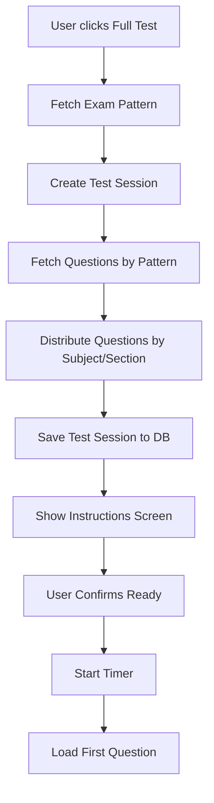
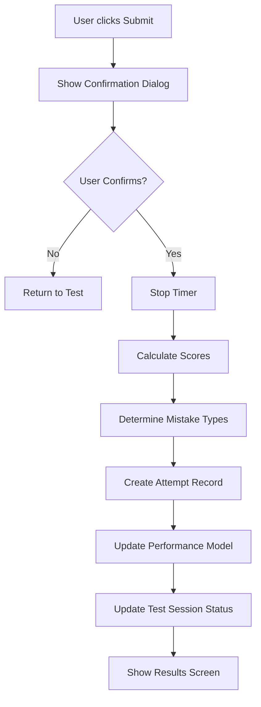

# Full Length Test - Complete Implementation Plan

## Goal
Implement a fully functional Full Length Test system that:
- Follows real exam patterns (JEE Main, GATE, NEET)
- Properly distributes questions by subject
- Implements correct marking schemes
- Saves all test data to database
- Updates user performance metrics
- Provides detailed test analytics

---

## Real Exam Patterns Research

### JEE Main Pattern (B.E./B.Tech - Paper 1)
- **Total Questions:** 90 (75 to attempt)
- **Total Marks:** 300
- **Duration:** 180 minutes (3 hours)
- **Subjects:** Physics, Chemistry, Mathematics (30 questions each)

**Section Distribution per Subject:**
- **Section A:** 20 MCQs (compulsory)
- **Section B:** 10 Numerical (attempt any 5)

**Marking Scheme:**
- Correct: +4 marks
- Incorrect: -1 mark
- Unattempted: 0 marks

---

### GATE Pattern (CS/IT Example)
- **Total Questions:** 65
- **Total Marks:** 100
- **Duration:** 180 minutes (3 hours)

**Section Distribution:**
- **General Aptitude:** 10 questions (15 marks)
- **Engineering Mathematics:** 10 questions (13 marks)
- **Core Subject:** 45 questions (72 marks)

**Question Types:**
- MCQ (Multiple Choice)
- MSQ (Multiple Select)
- NAT (Numerical Answer Type)

**Marking Scheme:**
- 1-mark MCQ: +1 correct, -1/3 incorrect
- 2-mark MCQ: +2 correct, -2/3 incorrect
- MSQ/NAT: No negative marking

---

### NEET Pattern
- **Total Questions:** 200 (180 to attempt)
- **Total Marks:** 720
- **Duration:** 200 minutes (3 hours 20 minutes)
- **Subjects:** Physics, Chemistry, Botany, Zoology

**Section Distribution per Subject:**
- **Section A:** 35 MCQs (compulsory)
- **Section B:** 15 MCQs (attempt any 10)

**Marking Scheme:**
- Correct: +4 marks
- Incorrect: -1 mark
- Unattempted: 0 marks

---

## User Review Required

> [!IMPORTANT]
> **Exam Pattern Configuration**
> Each exam type will have a predefined pattern stored in the database. The system will automatically fetch the correct number of questions per subject based on the selected exam.

> [!WARNING]
> **Database Schema Changes**
> This implementation requires significant changes to existing schemas:
> - New `TestSession` model for tracking active tests
> - Enhanced `Attempt` model with detailed question-level data
> - Updated `Performance` model calculations
> - New `ExamPattern` configuration model

---

## Proposed Changes

### Backend Changes

#### [NEW] `backend/models/ExamPattern.js`
Define exam patterns for different exams:
```javascript
{
  examName: "JEE Main",
  totalQuestions: 90,
  questionsToAttempt: 75,
  totalMarks: 300,
  duration: 180, // minutes
  subjects: [
    {
      name: "Physics",
      sections: [
        { name: "A", type: "MCQ", count: 20, compulsory: true, marksPerQuestion: 4 },
        { name: "B", type: "NAT", count: 10, attemptAny: 5, marksPerQuestion: 4 }
      ]
    },
    // ... Chemistry, Mathematics
  ],
  negativeMarking: {
    MCQ: -1,
    NAT: 0
  }
}
```

#### [NEW] `backend/models/TestSession.js`
Track active test sessions:
```javascript
{
  userId: ObjectId,
  examType: String,
  testType: String, // 'full', 'subject', etc.
  questions: [
    {
      questionId: ObjectId,
      subject: String,
      section: String,
      marksAllocated: Number,
      questionNumber: Number
    }
  ],
  startTime: Date,
  endTime: Date,
  duration: Number, // minutes
  status: String, // 'active', 'submitted', 'expired'
  responses: Map, // questionId -> { answer, timeTaken, marked }
  timeRemaining: Number
}
```

#### [MODIFY] `backend/models/Attempt.js`
Enhanced attempt schema:
```javascript
{
  userId: ObjectId,
  testSessionId: ObjectId,
  examType: String,
  testType: String,
  subject: String, // For subject-wise tests
  
  // Question-level details
  questions: [
    {
      questionId: ObjectId,
      questionText: String,
      options: [String],
      correctAnswer: String,
      userAnswer: String,
      isCorrect: Boolean,
      marksAwarded: Number,
      marksAllocated: Number,
      timeTaken: Number, // seconds
      marked: Boolean,
      mistakeType: String, // 'Conceptual', 'Speed', 'Guess', 'None', 'Unattempted'
      subject: String,
      topic: String,
      difficulty: String
    }
  ],
  
  // Summary statistics
  totalQuestions: Number,
  totalAttempted: Number,
  totalCorrect: Number,
  totalWrong: Number,
  totalUnattempted: Number,
  
  // Scoring
  score: Number,
  totalMarks: Number,
  accuracy: Number,
  
  // Subject-wise breakdown
  subjectWise: Map, // subject -> { attempted, correct, wrong, score }
  
  // Time tracking
  totalTimeTaken: Number,
  avgTimePerQuestion: Number,
  
  // Metadata
  createdAt: Date,
  submittedAt: Date
}
```

#### [NEW] `backend/controllers/test.controller.js`
New controller for test management:
- `startFullTest` - Initialize test session with proper question distribution
- `getTestSession` - Retrieve active test session
- `saveResponse` - Save individual question response
- `submitTest` - Complete test and calculate results
- `getTestResults` - Retrieve test results and analytics

#### [NEW] `backend/routes/test.routes.js`
```javascript
router.post('/start-full-test', auth, testController.startFullTest);
router.get('/session/:sessionId', auth, testController.getTestSession);
router.post('/session/:sessionId/response', auth, testController.saveResponse);
router.post('/session/:sessionId/submit', auth, testController.submitTest);
router.get('/results/:attemptId', auth, testController.getTestResults);
```

#### [MODIFY] `backend/controllers/question.controller.js`
Add method to fetch questions by exam pattern:
```javascript
exports.getQuestionsByPattern = async (req, res) => {
  // Fetch questions according to exam pattern
  // Distribute by subject and section
  // Ensure proper randomization
}
```

---

### Frontend Changes

#### [MODIFY] `frontend/src/pages/tests/FullTestUI.jsx`
Complete redesign with:
- Question palette showing all questions
- Section-wise navigation
- Timer with auto-submit
- Mark for review functionality
- Response saving (auto-save every 30 seconds)
- Submit confirmation dialog
- Instructions screen before test

#### [NEW] `frontend/src/pages/tests/TestInstructions.jsx`
Pre-test instructions screen:
- Exam pattern details
- Marking scheme
- Time duration
- Navigation instructions
- "I am ready to begin" button

#### [NEW] `frontend/src/pages/tests/TestResults.jsx`
Post-test results screen:
- Overall score and rank
- Subject-wise performance
- Question-wise analysis
- Time analysis
- Comparison with previous attempts
- Download scorecard option

#### [NEW] `frontend/src/services/testSession.service.js`
```javascript
{
  startFullTest(examType),
  getSession(sessionId),
  saveResponse(sessionId, questionId, response),
  submitTest(sessionId),
  getResults(attemptId)
}
```

---

## Database Schema Details

### ExamPattern Schema
```javascript
const examPatternSchema = new mongoose.Schema({
  examName: { type: String, required: true, unique: true },
  displayName: String,
  totalQuestions: Number,
  questionsToAttempt: Number,
  totalMarks: Number,
  duration: Number, // minutes
  
  subjects: [{
    name: String,
    displayName: String,
    sections: [{
      name: String, // 'A', 'B'
      type: String, // 'MCQ', 'NAT', 'MSQ'
      count: Number,
      compulsory: Boolean,
      attemptAny: Number, // For optional sections
      marksPerQuestion: Number
    }]
  }],
  
  negativeMarking: {
    MCQ: Number,
    NAT: Number,
    MSQ: Number
  },
  
  instructions: [String],
  active: { type: Boolean, default: true }
});
```

### TestSession Schema
```javascript
const testSessionSchema = new mongoose.Schema({
  userId: { type: mongoose.Schema.Types.ObjectId, ref: 'User', required: true },
  examType: { type: String, required: true },
  testType: { type: String, enum: ['full', 'subject', 'topic', 'revision'], default: 'full' },
  
  questions: [{
    questionId: { type: mongoose.Schema.Types.ObjectId, ref: 'Question' },
    subject: String,
    section: String,
    questionNumber: Number,
    marksAllocated: Number
  }],
  
  responses: {
    type: Map,
    of: {
      answer: mongoose.Schema.Types.Mixed, // String or Number
      timeTaken: Number,
      marked: Boolean,
      timestamp: Date
    }
  },
  
  startTime: { type: Date, default: Date.now },
  endTime: Date,
  duration: Number, // minutes
  timeRemaining: Number,
  
  status: { type: String, enum: ['active', 'submitted', 'expired'], default: 'active' },
  
  metadata: {
    ipAddress: String,
    userAgent: String,
    tabSwitches: Number,
    warnings: [String]
  }
}, { timestamps: true });
```

### Enhanced Attempt Schema
```javascript
const attemptSchema = new mongoose.Schema({
  userId: { type: mongoose.Schema.Types.ObjectId, ref: 'User', required: true, index: true },
  testSessionId: { type: mongoose.Schema.Types.ObjectId, ref: 'TestSession' },
  
  examType: { type: String, required: true },
  testType: { type: String, required: true },
  subject: String,
  
  questions: [{
    questionId: { type: mongoose.Schema.Types.ObjectId, ref: 'Question' },
    questionText: String,
    options: [String],
    correctAnswer: mongoose.Schema.Types.Mixed,
    userAnswer: mongoose.Schema.Types.Mixed,
    isCorrect: Boolean,
    marksAwarded: Number,
    marksAllocated: Number,
    timeTaken: Number,
    marked: Boolean,
    mistakeType: { type: String, enum: ['Conceptual', 'Speed', 'Guess', 'None', 'Unattempted'] },
    subject: String,
    topic: String,
    difficulty: String,
    section: String
  }],
  
  totalQuestions: Number,
  totalAttempted: Number,
  totalCorrect: Number,
  totalWrong: Number,
  totalUnattempted: Number,
  totalMarked: Number,
  
  score: Number,
  totalMarks: Number,
  accuracy: Number,
  percentage: Number,
  
  subjectWise: {
    type: Map,
    of: {
      attempted: Number,
      correct: Number,
      wrong: Number,
      unattempted: Number,
      score: Number,
      maxScore: Number,
      accuracy: Number
    }
  },
  
  totalTimeTaken: Number,
  avgTimePerQuestion: Number,
  
  createdAt: { type: Date, default: Date.now },
  submittedAt: Date
}, { timestamps: true });
```

---

## Implementation Flow

### 1. Test Initialization


### 2. During Test
- Auto-save responses every 30 seconds
- Track time per question
- Allow navigation between questions
- Mark for review functionality
- Section-wise filtering
- Warning before time expires

### 3. Test Submission


---

## Scoring Algorithm

### Calculate Marks
```javascript
function calculateMarks(question, userAnswer, pattern) {
  if (!userAnswer) return 0; // Unattempted
  
  const isCorrect = checkAnswer(question, userAnswer);
  const marksAllocated = question.marksAllocated;
  
  if (isCorrect) {
    return marksAllocated;
  } else {
    const questionType = question.type;
    const negativeMarks = pattern.negativeMarking[questionType] || 0;
    return negativeMarks;
  }
}
```

### Determine Mistake Type
```javascript
function determineMistakeType(question, userAnswer, timeTaken) {
  if (!userAnswer) return 'Unattempted';
  
  const isCorrect = checkAnswer(question, userAnswer);
  if (isCorrect) return 'None';
  
  const avgTime = 120; // 2 minutes
  
  if (timeTaken < 30) {
    return 'Speed'; // Too fast, likely careless
  } else if (timeTaken > 180) {
    return 'Conceptual'; // Took long time, concept unclear
  } else {
    return 'Guess'; // Moderate time, likely guessed
  }
}
```

---

## Verification Plan

### Backend Testing
1. **Exam Pattern Seeding**
   - Seed JEE Main, GATE, NEET patterns
   - Verify pattern retrieval

2. **Test Session Creation**
   - Start full test for each exam type
   - Verify question distribution matches pattern
   - Check subject-wise allocation

3. **Response Saving**
   - Save individual responses
   - Verify auto-save functionality
   - Test concurrent response updates

4. **Test Submission**
   - Submit test with various response combinations
   - Verify score calculation
   - Check negative marking
   - Validate attempt record creation
   - Confirm performance model updates

### Frontend Testing
1. **Test Flow**
   - Start full test
   - Navigate through questions
   - Mark for review
   - Submit test
   - View results

2. **Timer Functionality**
   - Verify countdown
   - Test auto-submit on timeout
   - Check time warnings

3. **Question Palette**
   - Verify color coding (answered, marked, unattempted)
   - Test navigation
   - Check section filtering

4. **Results Screen**
   - Verify score display
   - Check subject-wise breakdown
   - Test analytics charts

---

## File Summary

### Backend Files

#### New Files
1. `backend/models/ExamPattern.js`
2. `backend/models/TestSession.js`
3. `backend/controllers/test.controller.js`
4. `backend/routes/test.routes.js`
5. `backend/utils/scoringEngine.js`
6. `backend/seeders/examPatterns.seeder.js`

#### Modified Files
1. `backend/models/Attempt.js` - Enhanced schema
2. `backend/models/Performance.js` - Updated calculations
3. `backend/server.js` - Register test routes

### Frontend Files

#### New Files
1. `frontend/src/pages/tests/TestInstructions.jsx`
2. `frontend/src/pages/tests/TestResults.jsx`
3. `frontend/src/services/testSession.service.js`
4. `frontend/src/components/QuestionPalette.jsx`
5. `frontend/src/components/TestTimer.jsx`

#### Modified Files
1. `frontend/src/pages/tests/FullTestUI.jsx` - Complete redesign
2. `frontend/src/pages/tests/Tests.jsx` - Integration
3. `frontend/src/services/api.js` - Add test session methods

---

## Exam Pattern Configuration

### JEE Main Configuration
```javascript
{
  examName: "JEE Main",
  totalQuestions: 90,
  questionsToAttempt: 75,
  totalMarks: 300,
  duration: 180,
  subjects: [
    {
      name: "Physics",
      sections: [
        { name: "A", type: "MCQ", count: 20, compulsory: true, marksPerQuestion: 4 },
        { name: "B", type: "NAT", count: 10, attemptAny: 5, marksPerQuestion: 4 }
      ]
    },
    {
      name: "Chemistry",
      sections: [
        { name: "A", type: "MCQ", count: 20, compulsory: true, marksPerQuestion: 4 },
        { name: "B", type: "NAT", count: 10, attemptAny: 5, marksPerQuestion: 4 }
      ]
    },
    {
      name: "Mathematics",
      sections: [
        { name: "A", type: "MCQ", count: 20, compulsory: true, marksPerQuestion: 4 },
        { name: "B", type: "NAT", count: 10, attemptAny: 5, marksPerQuestion: 4 }
      ]
    }
  ],
  negativeMarking: { MCQ: -1, NAT: 0 }
}
```

### GATE CS Configuration
```javascript
{
  examName: "GATE CS",
  totalQuestions: 65,
  questionsToAttempt: 65,
  totalMarks: 100,
  duration: 180,
  subjects: [
    {
      name: "General Aptitude",
      sections: [
        { name: "A", type: "MCQ", count: 10, compulsory: true, marksPerQuestion: 1.5 }
      ]
    },
    {
      name: "Engineering Mathematics",
      sections: [
        { name: "A", type: "MCQ", count: 10, compulsory: true, marksPerQuestion: 1.3 }
      ]
    },
    {
      name: "Computer Science",
      sections: [
        { name: "A", type: "MCQ", count: 25, compulsory: true, marksPerQuestion: 1 },
        { name: "B", type: "MCQ", count: 20, compulsory: true, marksPerQuestion: 2 }
      ]
    }
  ],
  negativeMarking: { MCQ: -0.33 } // 1/3 for 1-mark, 2/3 for 2-mark
}
```

---

## Next Steps After Implementation

1. **Analytics Dashboard** - Detailed performance analytics
2. **Rank Prediction** - Based on historical data
3. **Comparison Tool** - Compare with peers
4. **Test Series** - Multiple full tests with progress tracking
5. **Adaptive Testing** - Adjust difficulty based on performance
