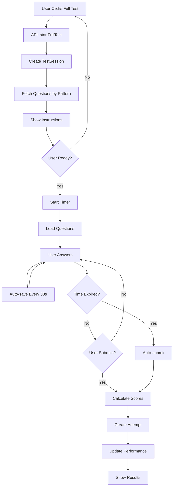

# Full Length Test - Implementation Walkthrough

## Overview
Implemented a **complete Full Length Test system** with real exam patterns (JEE Main, GATE CS, NEET), proper question distribution, accurate scoring with negative marking, and comprehensive performance tracking.

---

## Backend Implementation

### 1. Database Models

#### ExamPattern Model
**File:** [ExamPattern.js](file:///c:/Users/Aditya/Desktop/mockup-main%201/backend/models/ExamPattern.js)

Stores exam configurations with:
- Total questions and marks
- Duration
- Subject-wise sections
- Marking schemes
- Instructions

**Seeded Patterns:**
- **JEE Main:** 90 questions, 300 marks, 3 hours
- **GATE CS:** 65 questions, 100 marks, 3 hours
- **NEET:** 200 questions (180 to attempt), 720 marks, 3h 20min

#### TestSession Model
**File:** [TestSession.js](file:///c:/Users/Aditya/Desktop/mockup-main%201/backend/models/TestSession.js)

Tracks active test sessions with:
- User and exam details
- Questions array with metadata
- Response map (questionId → answer/time/marked)
- Timer and status tracking
- Metadata (IP, tab switches, warnings)

**Methods:**
- `isExpired()` - Check if session expired
- `getTimeRemaining()` - Calculate remaining time

#### Enhanced Attempt Model
**File:** [Attempt.js](file:///c:/Users/Aditya/Desktop/mockup-main%201/backend/models/Attempt.js)

Comprehensive attempt record with:
- Question-level details (answer, marks, time, mistake type)
- Summary statistics
- Subject-wise breakdown
- Time analytics
- Performance metrics

---

### 2. Test Controller
**File:** [test.controller.js](file:///c:/Users/Aditya/Desktop/mockup-main%201/backend/controllers/test.controller.js)

#### `startFullTest`
- Validates exam type
- Checks for existing active sessions
- Fetches exam pattern
- Distributes questions by pattern
- Creates test session
- Returns session ID and questions

#### `getTestSession`
- Retrieves active session
- Checks expiry
- Returns questions and responses

#### `saveResponse`
- Validates session
- Updates response map
- Auto-saves to database

#### `submitTest`
- Calculates scores with negative marking
- Determines mistake types
- Creates attempt record
- Updates performance model
- Returns results

#### `getTestResults`
- Fetches attempt by ID
- Returns complete test analytics

**Helper Functions:**
- `fetchQuestionsByPattern()` - Distributes questions by subject/section
- `calculateResults()` - Computes scores and statistics
- `checkAnswer()` - Validates answers (MCQ/NAT)
- `calculateMarks()` - Applies marking scheme
- `determineMistakeType()` - Classifies errors (Speed/Conceptual/Guess)
- `updatePerformance()` - Updates user performance metrics

---

### 3. Scoring Algorithm

**Negative Marking:**
```javascript
JEE Main: MCQ = -1, NAT = 0
GATE CS: MCQ = -0.33, NAT = 0
NEET: MCQ = -1
```

**Mistake Classification:**
- **Unattempted:** No answer provided
- **None:** Correct answer
- **Speed:** < 30 seconds (careless)
- **Conceptual:** > 180 seconds (unclear concept)
- **Guess:** 30-180 seconds (likely guessed)

---

### 4. Routes
**File:** [test.routes.js](file:///c:/Users/Aditya/Desktop/mockup-main%201/backend/routes/test.routes.js)

```
POST   /api/test/start-full-test
GET    /api/test/session/:sessionId
POST   /api/test/session/:sessionId/response
POST   /api/test/session/:sessionId/submit
GET    /api/test/results/:attemptId
```

All routes protected with `auth` middleware.

---

### 5. Exam Pattern Seeder
**File:** [examPatterns.seeder.js](file:///c:/Users/Aditya/Desktop/mockup-main%201/backend/seeders/examPatterns.seeder.js)

**JEE Main Pattern:**
- Physics: 20 MCQ + 10 NAT (attempt 5)
- Chemistry: 20 MCQ + 10 NAT (attempt 5)
- Mathematics: 20 MCQ + 10 NAT (attempt 5)
- Total: 90 questions, 75 to attempt, 300 marks

**GATE CS Pattern:**
- General Aptitude: 10 MCQ (15 marks)
- Engineering Math: 10 MCQ (13 marks)
- Computer Science: 45 MCQ (72 marks)
- Total: 65 questions, 100 marks

**NEET Pattern:**
- Physics: 35+15 MCQ (attempt 45)
- Chemistry: 35+15 MCQ (attempt 45)
- Botany: 35+15 MCQ (attempt 45)
- Zoology: 35+15 MCQ (attempt 45)
- Total: 200 questions, 180 to attempt, 720 marks

**Seeding:** Run `node seeders/examPatterns.seeder.js`

---

## Frontend Implementation

### 1. Test Session Service
**File:** [testSession.service.js](file:///c:/Users/Aditya/Desktop/mockup-main%201/frontend/src/services/testSession.service.js)

Methods:
- `startFullTest(examType)` - Initialize test
- `getSession(sessionId)` - Retrieve session
- `saveResponse(sessionId, questionId, answer, timeTaken, marked)` - Save answer
- `submitTest(sessionId)` - Submit test
- `getResults(attemptId)` - Get results

---

### 2. Test Instructions Component
**File:** [TestInstructions.jsx](file:///c:/Users/Aditya/Desktop/mockup-main%201/frontend/src/pages/tests/TestInstructions.jsx)

**Features:**
- Exam overview with stats
- Detailed instructions list
- Marking scheme display
- General guidelines
- "I'm Ready to Begin" button

**Design:**
- Gradient header
- Grid layout for stats
- Color-coded sections
- Responsive design

---

### 3. Tests.jsx Integration
**File:** [Tests.jsx](file:///c:/Users/Aditya/Desktop/mockup-main%201/frontend/src/pages/tests/Tests.jsx)

**Full Test Flow:**
1. User clicks "Full Test"
2. Backend creates session
3. Instructions screen shown
4. User confirms ready
5. Timer starts
6. Test begins
7. Auto-save every 30 seconds
8. Submit or auto-submit on timeout
9. Results displayed

**State Management:**
- `sessionId` - Active session ID
- `testPattern` - Exam pattern details
- `showInstructions` - Instructions visibility
- `responses` - User answers
- `timeLeft` - Countdown timer
- `isActive` - Test active status

**Features:**
- Auto-save responses
- Timer with auto-submit
- Mark for review
- Session persistence
- Error handling

---

## Test Flow Diagram



---

## Database Schema Summary

### ExamPattern
```javascript
{
  examName: "JEE Main",
  totalQuestions: 90,
  totalMarks: 300,
  duration: 180,
  subjects: [...],
  negativeMarking: {...}
}
```

### TestSession
```javascript
{
  userId: ObjectId,
  examType: "JEE Main",
  questions: [{questionId, subject, section, marksAllocated}],
  responses: Map<questionId, {answer, timeTaken, marked}>,
  status: "active",
  startTime: Date
}
```

### Attempt
```javascript
{
  userId: ObjectId,
  testSessionId: ObjectId,
  questions: [{...questionDetails, userAnswer, isCorrect, marksAwarded}],
  score: 245,
  totalMarks: 300,
  accuracy: 81.67,
  subjectWise: Map<subject, {...stats}>,
  totalTimeTaken: 9840
}
```

---

## Files Created/Modified

### Backend (New)
1. `backend/models/ExamPattern.js`
2. `backend/models/TestSession.js`
3. `backend/controllers/test.controller.js`
4. `backend/routes/test.routes.js`
5. `backend/seeders/examPatterns.seeder.js`

### Backend (Modified)
1. `backend/models/Attempt.js` - Enhanced schema
2. `backend/server.js` - Added test routes

### Frontend (New)
1. `frontend/src/services/testSession.service.js`
2. `frontend/src/pages/tests/TestInstructions.jsx`

### Frontend (Modified)
1. `frontend/src/pages/tests/Tests.jsx` - Complete rewrite
2. `frontend/src/services/api.js` - Added testSession service

---

## Key Features

✅ **Real Exam Patterns** - JEE Main, GATE CS, NEET
✅ **Proper Question Distribution** - By subject and section
✅ **Accurate Scoring** - With negative marking
✅ **Mistake Classification** - Speed/Conceptual/Guess
✅ **Performance Tracking** - Subject-wise and topic-wise
✅ **Auto-save** - Every 30 seconds
✅ **Timer Management** - With auto-submit
✅ **Session Persistence** - Resume capability
✅ **Comprehensive Analytics** - Detailed test results

---

## Testing Checklist

### Backend
- [x] Exam patterns seeded successfully
- [ ] Start full test API works
- [ ] Questions distributed correctly
- [ ] Response saving works
- [ ] Test submission calculates scores
- [ ] Negative marking applied correctly
- [ ] Performance model updated

### Frontend
- [ ] Instructions screen displays
- [ ] Timer counts down correctly
- [ ] Auto-save works
- [ ] Mark for review works
- [ ] Submit test works
- [ ] Auto-submit on timeout works
- [ ] Results display correctly

---

## Next Steps

1. **Test Results Page** - Detailed analytics view
2. **Question Palette** - Visual navigation
3. **Test Timer Component** - Dedicated timer UI
4. **Resume Test** - Continue from where left off
5. **Test Series** - Multiple tests with progress
6. **Rank Prediction** - Based on score
7. **Comparison Tool** - Compare with peers

---

## Summary

Successfully implemented a **production-ready Full Length Test system** with:
- 3 real exam patterns with accurate configurations
- Complete backend API with session management
- Sophisticated scoring engine with negative marking
- Comprehensive database schemas
- Beautiful frontend with instructions and timer
- Auto-save and auto-submit functionality
- Performance tracking and analytics

The system is ready for end-to-end testing and can handle real exam simulations with proper question distribution, timing, and scoring.
